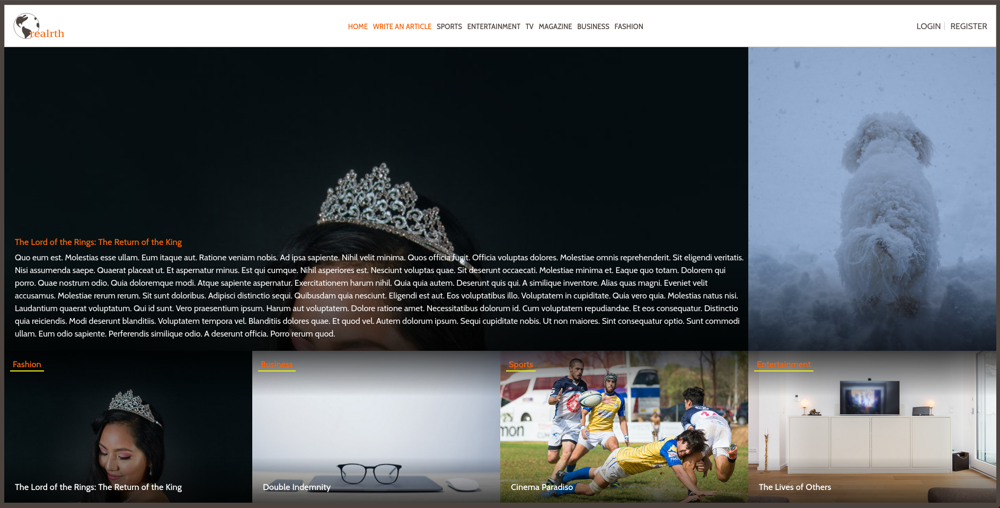

# Realrth - Articles website built with Ruby on Rails

> This repo includes code for the articles website Realrth, developed as the capstone project for Ruby on Rails section of Microverse's Full Stack Web-Dev program 
[Design idea](https://www.behance.net/gallery/14554909/liFEsTlye-Mobile-version) by Nelson [Sakwa on Behance](https://www.behance.net/sakwadesignstudio)


[entity-relationship Diagram](docs/erd.pdf)
### Check it online!
[Live preview](https://felipe-ror-capstone.herokuapp.com/)

## Built With
- Ruby v2.7.0
- Ruby on Rails v5.2.4.1

## Getting Started

To get a local copy up and running clone this repository to your
computer.

### Prerequisites

Ruby: 2.7.0
Rails: 5.2.4.1
Postgres: >=12.3
```
   rails db:create
   rails db:migrate
   rails db:seed
```

### Usage

#### Set up your credentials

edit config/application.yml.example with your credentials, and move it to config/application.yml

#### Update yarn packages
If prompted to, run:
```
  yarn install --check-files
```

#### Run migrations:

```
    rails db:migrate
```
#### Start server with:

```
    rails server
```
Open `http://localhost:3000/` in your browser.

### Run tests from root directory

```
    bundle exec rspec
```

## Author

👤Felipe dos Anjos

- Github: [fc-anjos](https://github.com/fc-anjos)
- Linkedin: [fc-anjos](https://linkedin.com/in/fc-anjos)

## Show your support

Give a ⭐️ if you like this project!

## 🤝 Contributing

Contributions, issues and feature requests are welcome!

Feel free to check the [issues
page](https://www.github.com/fc-anjos/ror-capstone/issues/).
